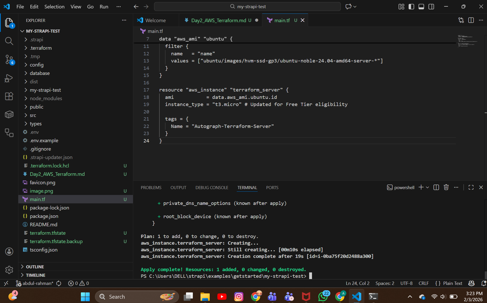
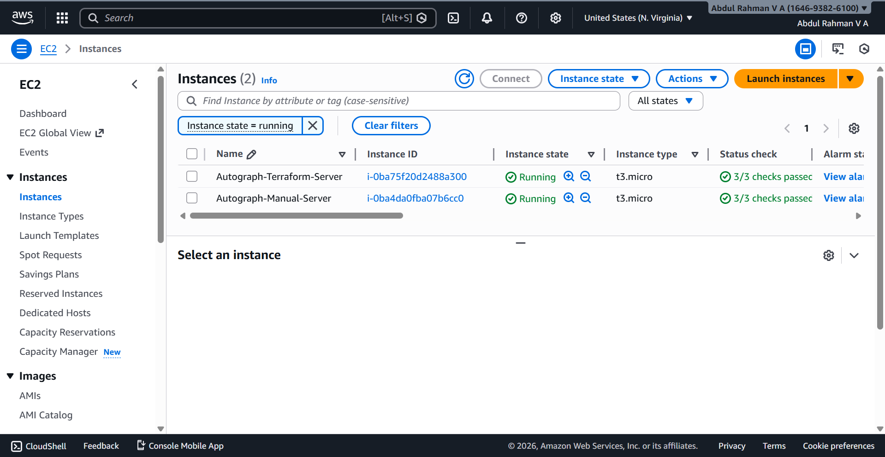

# Day 2 Task: AWS Core Concepts and Terraform

## 1. Manual EC2 Instance Provisioning
- **Step 1:** Logged into the AWS Management Console and navigated to the EC2 Dashboard.
- **Step 2:** Launched an instance named **Autograph-Manual-Server** using the Ubuntu AMI.
- **Step 3:** Selected the **t3.micro** instance type for Free Tier eligibility.
- **Step 4:** Configured security groups to allow SSH access on Port 22.
- **Result:** Instance successfully running with ID: `i-0ba4da0fba07b6cc0`.

## 2. Infrastructure as Code (Terraform)
- **Step 1:** Created a `main.tf` configuration file to automate the provisioning process.
- **Step 2:** Configured AWS CLI credentials via `aws configure` to resolve authentication errors.
- **Step 3:** Used a Terraform **Data Source** to dynamically fetch the latest Ubuntu 24.04 AMI.
- **Step 4:** Initialized the environment using `terraform init` and reviewed the plan with `terraform plan`.
- **Step 5:** Executed `terraform apply` to provision the automated instance.
- **Result:** Instance **Autograph-Terraform-Server** successfully launched with ID: `i-0ba75f20d2488a300`.

## 3. Troubleshooting & Learnings
- **Credential Resolution:** Resolved `InvalidClientTokenId` by switching from hardcoded keys to the `aws configure` CLI method.
- **AMI Handling:** Fixed `InvalidAMIID.Malformed` errors by replacing static AMI IDs with a dynamic search filter.
- **Eligibility Fix:** Resolved `InvalidParameterCombination` by switching the instance type from `t2.micro` to `t3.micro` to comply with regional Free Tier rules. 
